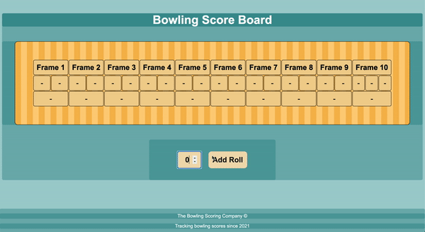
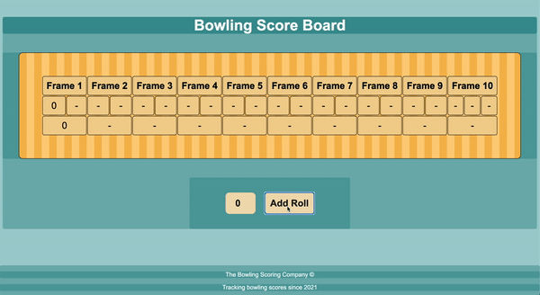

Bowling Score Tracker 🎳
========================

[](https://travis-ci.com/AJ8GH/bowling-challenge) [](https://coveralls.io/github/AJ8GH/bowling-challenge?branch=master) [](https://codeclimate.com/github/AJ8GH/bowling-challenge/maintainability)  [](https://bettercodehub.com/)

Bowling score tracker written in JavaScript

[Dependencies](#dependencies) | [Getting Started](#getting-started) | [Running Tests](#runnning-tests) | [Objectives](#objectives) | [Design](#design) | [Usage](#usage) | [User Stories](#user-stories) | [Deployed App](#deployed-version)

## Example usage:

***A perfect game*** 🙂



***A gutter game*** 🙁



## Deployed app

You can use the deployed app [here](https://bowling-score-tracker.surge.sh/)

## Dependencies
- `"coveralls": "^3.1.0"`
- `"eslint": "^7.21.0"`
- `"eslint-config-airbnb-base": "^14.2.1"`
- `"eslint-plugin-import": "^2.22.1"`
- `"jasmine": "^3.6.4"`
- `"karma": "^6.2.0"`
- `"karma-chrome-launcher": "^3.1.0"`
- `"karma-cli": "^2.0.0"`
- `"karma-coverage": "^2.0.3"`
- `"karma-coveralls": "^2.1.0"`
- `"karma-jasmine": "^4.0.1"`
- `"nyc": "^15.1.0"`

## Getting Started

Start by cloning this repository

```shell
git clone git@github.com:AJ8GH/bowling-challenge.git
```

Ensure you have Node installed, by running `node -v`. If not you can download it [here](https://nodejs.org/en/download/).

Navigate to the root of the project and install the dependencies.

```shell
cd bowling-score-tracker
npm install
```

## Runnning tests:

To run tests from the terminal, run `npm test`

To run tests in the browser, open `public/js/spec/SpecRunner.html` in the browser, which also gives an overview of the public interfaces and functionality of the classes and the app as a whole.

## Objectives

The purpose of this project was to build a score calculator for 10 pin bowling. Bowling is a deceptively complex game and the goal here was to build a working app with high code quality, using test driven development. Once the game logic was complete I used jQuery, HTML and CSS to create a responsive UI and deployed the app through surge. I used Travis CI and Coveralls to automate testing and coverage, and ESLint, CodeClimate and Better Code to ensure high code quality and maintainability.

### Testing:
- I used Jasmine to write automated unit and feature tests which can be run in the browser. The code base was written using TDD, with a red-green-refactor approach.
- The feature specs focus on running through an entire game, to ensure the program functions as expected. The unit specs test individual functions in isolation.
- I chose to mock the Frame class in the game class tests, using dependency injection, to ensure the classes were tested in isolation:

```js
// dependency injection in game.js
class Game {
  constructor (frameClass = Frame) {
  // ...

// mocking the implementation of Frame in gameSpec.js using Jasime spies
  beforeEach(() => {
    frameClass = jasmine.createSpy('frameClass');
    game = new Game(frameClass);
    // ...
```

- I used Karma and ChromeHeadless to enable runnings tests from the terminal. This then enabled me to Implement CI using Travis.
- Using NYC and Coveralls I then set up automated test coverage reports for the codebase.
- Note - NYC currently fails to report coverage when running tests locally, however the stats are accurately sent to coveralls, which shows > 97% test coverage.

### Edge cases:
- Guard conditions are implemented to prevent invalid inputs. Errors will be thrown when non-numbers or 'empty' rolls are entered, as well as if the roll is greater than the number of reamining pins for the frame.
- An error is also thrown when attempting to input a roll when the game is over.

### Code Quality:
- My focus was around building encapsulated classes and single responsibility functions.
- For linting I used ESLint to enforce the standard JS style
- I used CodeClimate and Better Code Hub to check the repository for code smells and technical debt, with both at maximum scores.

### Workflow:
- Git: small, consistent commits at green and refactoring stages, using clear and communicative commit messages
- Agile: creating user stories from a fuzzy specification, then test driving and implementing the features

### Documentation:
- My aim was to create comprehensive and clear documentation, to ensure other developers could easily use and contribute to the project

### Design:
- Private functions are prefixed with underscores, e.g. `frame._isStrike()`
- Predicate functions which return boolean values begin with the word 'is', e.g. `game.isOver()`
- **Game class**: Responsible for tracking the frames and the progress of the game
- **Frame class**: Responsible for tracking its rolls, score and bonuses
- **Interface**: Built using js and jQuery, responsible for updating the view after each roll input

## Usage

Public Interfaces:

**Game**
- `#addRoll()` -Takes integer argument between 0 and 10. Throws error if the game is over or if an invalid input is entered
- `#totalScore()` - Returns the sum of the scores of all frames so far
- `#calculateScores()` - Returns an array of the total gamescore so far for each frame. e.g. after 3 strikes, it would return `[30, 50, 60]`
- `isOver()` - Returns true or false if game is over or not over

**Frame**
The Game object interacts with the Frames, the user does not interact with Frame objects directly
- `#addRoll()` - Takes integer argument, adds roll to `this.rolls` array
- `#score()` - Returns the total score of the frame instance
- `#makeFinal()` - sets `this.isFinal` to true, to adjust logic for the final frame
- `#addBonus()` - Adds bonus score if needed (frames are aware of how many bonuses they need)
- `#isOver()` - returns true if frame is over, false if it's not


### Sequence Diagrams

#### Spare Bonus


#### Strike Bonus


### User Stories
```
As a bowler,
So that I can track my score while I play,
I want to be able to record a score from 1 roll.

As a bowler,
So that I can track my total score easily throughout a game,
I want my scores to automatically accumlate as I enter them.

As a bowler,
So that my score is accurate and my experience is enjoyable,
I want my bonuses to be added to frames automatically.

As a bowler,
So that I can get extra points,
I want the final frame to allow a bonus roll if I get a spare.

As a bowler,
So that I can bowl a perfect game,
I want the final frame to allow 2 bonus rolls if I get a strike.

As a bowler,
So that my game flows and I can focus on the bowling,
I want the game to automatically register when it is the final frame.
```
